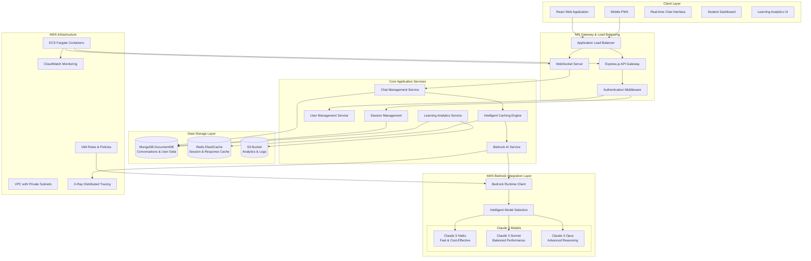
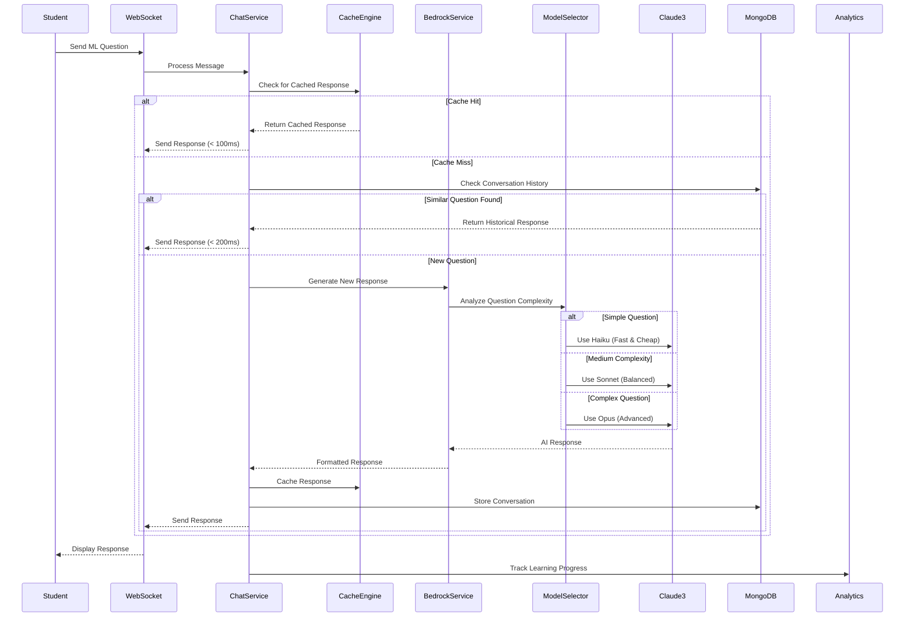

# ML-E AWS Bedrock Enhancement - Design Document

## Overview

This design document outlines the comprehensive architecture for enhancing the ML-E (Machine Learning Education) platform by migrating from OpenAI GPT integration to AWS Bedrock with Claude 3 models. The enhancement focuses on creating a cloud-native, cost-effective, and educationally optimized AI tutoring system for high school students.

**Key Design Goals:**
- Native AWS ecosystem integration for improved performance and security
- Intelligent model selection based on question complexity and educational context
- 37.5% cost reduction while maintaining or improving response quality
- Enhanced conversation persistence and duplicate detection
- Scalable architecture supporting thousands of concurrent students

## Architecture

### System Architecture Overview



### Enhanced Conversation Flow Architecture



## Components and Interfaces

### 1. Bedrock AI Service

**Purpose:** Core AI service managing AWS Bedrock integration with intelligent model selection and educational optimization.

**Key Responsibilities:**
- Question complexity analysis and model selection
- Educational prompt engineering for grade-appropriate responses
- Token usage optimization and cost tracking
- Response quality assurance and educational alignment

**Interface:**
```typescript
interface BedrockService {
    generateMLResponse(
        question: string, 
        userGrade: number, 
        conversationHistory?: ConversationContext[]
    ): Promise<BedrockResponse>;
    
    analyzeQuestionComplexity(question: string): QuestionComplexity;
    selectOptimalModel(complexity: QuestionComplexity): ModelConfiguration;
    buildEducationalPrompt(question: string, grade: number, context: ConversationContext[]): string;
    trackUsageMetrics(response: BedrockResponse): void;
}

interface BedrockResponse {
    message: string;
    model: string;
    confidence: number;
    tokensUsed: TokenUsage;
    responseTime: number;
    metadata: ResponseMetadata;
}

interface QuestionComplexity {
    level: 'simple' | 'medium' | 'complex';
    keywords: string[];
    estimatedTokens: number;
    recommendedModel: string;
}
```

### 2. Intelligent Caching Engine

**Purpose:** Multi-layered caching system optimizing response times and reducing AI service costs.

**Caching Strategy:**
- **L1 Cache (Redis):** Recent responses and session data (TTL: 1 hour)
- **L2 Cache (MongoDB):** Historical conversations with similarity matching (Persistent)
- **L3 Cache (Memory):** Frequently asked questions and common patterns (TTL: 30 minutes)

**Interface:**
```typescript
interface CacheEngine {
    checkCache(question: string, userId: string, sessionId: string): Promise<CachedResponse | null>;
    storeResponse(question: string, response: BedrockResponse, metadata: CacheMetadata): Promise<void>;
    findSimilarQuestions(question: string, threshold: number): Promise<SimilarQuestion[]>;
    invalidateUserCache(userId: string): Promise<void>;
    getCacheStatistics(): Promise<CacheStats>;
}

interface CachedResponse {
    content: string;
    source: 'redis' | 'mongodb' | 'memory';
    timestamp: Date;
    similarity: number;
    originalModel: string;
}
```

### 3. Session Management Service

**Purpose:** Persistent conversation handling with enhanced user experience across navigation.

**Key Features:**
- Seamless session restoration after page refresh
- Conversation context preservation
- User progress tracking across sessions
- Multi-device session synchronization

**Interface:**
```typescript
interface SessionService {
    createSession(userId: string, metadata: SessionMetadata): Promise<Session>;
    getSession(sessionId: string): Promise<Session | null>;
    updateSession(sessionId: string, updates: Partial<Session>): Promise<void>;
    getConversationHistory(sessionId: string, limit?: number): Promise<ConversationMessage[]>;
    persistMessage(sessionId: string, message: ConversationMessage): Promise<void>;
    getUserActiveSessions(userId: string): Promise<Session[]>;
}

interface Session {
    id: string;
    userId: string;
    startTime: Date;
    lastActivity: Date;
    messageCount: number;
    topicsDiscussed: string[];
    learningProgress: LearningProgress;
    metadata: SessionMetadata;
}
```

### 4. Learning Analytics Service

**Purpose:** Educational progress tracking and personalized learning insights.

**Analytics Capabilities:**
- Real-time learning progress tracking
- Topic mastery assessment
- Personalized learning recommendations
- Performance analytics and reporting

**Interface:**
```typescript
interface AnalyticsService {
    trackProgress(event: LearningEvent): Promise<void>;
    getUserProgress(userId: string): Promise<UserProgress>;
    getTopicMastery(userId: string, topic: string): Promise<TopicMastery>;
    generateLearningInsights(userId: string): Promise<LearningInsights>;
    getClassroomAnalytics(classId: string): Promise<ClassroomAnalytics>;
}

interface LearningEvent {
    userId: string;
    sessionId: string;
    eventType: 'question_asked' | 'concept_learned' | 'topic_completed';
    topic: string;
    difficulty: number;
    responseTime: number;
    accuracy?: number;
    metadata: Record<string, any>;
}
```

## Data Models

### 1. User and Authentication Models

```typescript
interface User {
    id: string;
    email: string;
    username: string;
    grade: 9 | 10;
    school?: string;
    preferences: UserPreferences;
    learningProfile: LearningProfile;
    createdAt: Date;
    lastLogin: Date;
}

interface UserPreferences {
    preferredExplanationStyle: 'visual' | 'textual' | 'mixed';
    difficultyPreference: 'adaptive' | 'challenging' | 'supportive';
    notificationSettings: NotificationSettings;
    privacySettings: PrivacySettings;
}

interface LearningProfile {
    strongTopics: string[];
    improvementAreas: string[];
    learningPace: 'fast' | 'medium' | 'slow';
    preferredModelComplexity: 'simple' | 'balanced' | 'advanced';
}
```

### 2. Conversation and Message Models

```typescript
interface ConversationMessage {
    id: string;
    sessionId: string;
    userId: string;
    sender: 'student' | 'tutor';
    content: string;
    timestamp: Date;
    messageType: 'question' | 'answer' | 'clarification' | 'example';
    metadata: MessageMetadata;
}

interface MessageMetadata {
    topic?: string;
    complexity: QuestionComplexity;
    modelUsed?: string;
    tokensUsed?: TokenUsage;
    responseTime?: number;
    confidence?: number;
    educationalTags: string[];
}

interface ConversationContext {
    recentMessages: ConversationMessage[];
    currentTopic: string;
    userUnderstanding: number; // 0-100 scale
    sessionDuration: number;
    questionsAsked: number;
}
```

### 3. Analytics and Progress Models

```typescript
interface UserProgress {
    userId: string;
    overallProgress: number; // 0-100
    topicProgress: Record<string, TopicProgress>;
    streakDays: number;
    totalQuestionsAsked: number;
    conceptsMastered: string[];
    lastUpdated: Date;
}

interface TopicProgress {
    topicId: string;
    topicName: string;
    masteryLevel: number; // 0-100
    questionsAsked: number;
    correctAnswers: number;
    timeSpent: number; // minutes
    lastStudied: Date;
    difficulty: number; // 1-10
}

interface LearningInsights {
    userId: string;
    strengths: string[];
    improvementAreas: string[];
    recommendedTopics: string[];
    studyTimeRecommendation: number; // minutes per day
    personalizedTips: string[];
    progressTrend: 'improving' | 'stable' | 'declining';
}
```

## Error Handling

### 1. Bedrock Service Error Handling

**Error Categories:**
- **Model Unavailability:** Automatic fallback to alternative models
- **Rate Limiting:** Intelligent retry with exponential backoff
- **Authentication Errors:** IAM role validation and refresh
- **Network Timeouts:** Circuit breaker pattern implementation

**Error Handling Strategy:**
```typescript
class BedrockErrorHandler {
    async handleModelError(error: BedrockError, context: RequestContext): Promise<BedrockResponse> {
        switch (error.type) {
            case 'MODEL_UNAVAILABLE':
                return this.fallbackToAlternativeModel(context);
            case 'RATE_LIMIT_EXCEEDED':
                return this.retryWithBackoff(context);
            case 'AUTHENTICATION_ERROR':
                return this.refreshCredentialsAndRetry(context);
            case 'TIMEOUT':
                return this.handleTimeout(context);
            default:
                return this.generateFallbackResponse(context);
        }
    }
    
    private async fallbackToAlternativeModel(context: RequestContext): Promise<BedrockResponse> {
        const fallbackModels = this.getFallbackModels(context.originalModel);
        
        for (const model of fallbackModels) {
            try {
                return await this.invokeModel(model, context.prompt);
            } catch (error) {
                logger.warn(`Fallback model ${model} also failed:`, error);
                continue;
            }
        }
        
        throw new Error('All models unavailable');
    }
}
```

### 2. Cache Error Handling

**Cache Failure Strategy:**
- **Redis Unavailable:** Fall back to MongoDB historical search
- **MongoDB Unavailable:** Direct Bedrock invocation with logging
- **Memory Cache Issues:** Clear and rebuild cache automatically

### 3. Session Management Error Handling

**Session Recovery:**
- **Session Loss:** Automatic session recreation with conversation restoration
- **Concurrent Sessions:** Merge and synchronize session data
- **Data Corruption:** Validate and repair session data integrity

## Testing Strategy

### 1. Unit Testing

**Bedrock Service Testing:**
```typescript
describe('BedrockService', () => {
    describe('Model Selection', () => {
        test('should select Haiku for simple questions', async () => {
            const service = new BedrockService();
            const complexity = service.analyzeQuestionComplexity('What is ML?');
            expect(complexity.level).toBe('simple');
            expect(complexity.recommendedModel).toContain('haiku');
        });
        
        test('should select Sonnet for medium complexity', async () => {
            const service = new BedrockService();
            const complexity = service.analyzeQuestionComplexity('Explain neural network backpropagation');
            expect(complexity.level).toBe('medium');
            expect(complexity.recommendedModel).toContain('sonnet');
        });
    });
    
    describe('Educational Prompt Building', () => {
        test('should adapt prompts for grade level', () => {
            const service = new BedrockService();
            const grade9Prompt = service.buildEducationalPrompt('What is supervised learning?', 9, []);
            const grade10Prompt = service.buildEducationalPrompt('What is supervised learning?', 10, []);
            
            expect(grade9Prompt).toContain('9th grade');
            expect(grade10Prompt).toContain('10th grade');
            expect(grade9Prompt).not.toEqual(grade10Prompt);
        });
    });
});
```

### 2. Integration Testing

**End-to-End Conversation Flow:**
```typescript
describe('Conversation Flow Integration', () => {
    test('should handle complete conversation cycle', async () => {
        const testSession = await createTestSession();
        const question = 'What is machine learning?';
        
        // Send question through WebSocket
        const response = await sendQuestionViaWebSocket(testSession.id, question);
        
        // Verify response quality
        expect(response.message).toBeDefined();
        expect(response.responseTime).toBeLessThan(5000);
        expect(response.metadata.topic).toBe('machine learning basics');
        
        // Verify persistence
        const history = await getConversationHistory(testSession.id);
        expect(history).toHaveLength(2); // Question + Answer
    });
});
```

### 3. Performance Testing

**Load Testing Scenarios:**
- **Concurrent Users:** 1000 simultaneous students asking questions
- **Cache Performance:** 95% cache hit rate under normal load
- **Response Times:** P95 < 3 seconds, P99 < 5 seconds
- **Cost Optimization:** Verify 37.5% cost reduction vs OpenAI baseline

**Performance Benchmarks:**
```typescript
describe('Performance Benchmarks', () => {
    test('should maintain response times under load', async () => {
        const concurrentRequests = 100;
        const promises = Array(concurrentRequests).fill(null).map(() => 
            bedrockService.generateMLResponse('Explain neural networks', 10)
        );
        
        const startTime = Date.now();
        const responses = await Promise.all(promises);
        const totalTime = Date.now() - startTime;
        
        expect(responses).toHaveLength(concurrentRequests);
        expect(totalTime).toBeLessThan(10000); // 10 seconds for 100 requests
        
        const avgResponseTime = responses.reduce((sum, r) => sum + r.responseTime, 0) / responses.length;
        expect(avgResponseTime).toBeLessThan(3000);
    });
});
```

### 4. Educational Quality Testing

**Response Quality Validation:**
```typescript
describe('Educational Quality Assurance', () => {
    test('should provide age-appropriate explanations', async () => {
        const questions = [
            'What is supervised learning?',
            'How do neural networks work?',
            'Explain gradient descent'
        ];
        
        for (const question of questions) {
            const grade9Response = await bedrockService.generateMLResponse(question, 9);
            const grade10Response = await bedrockService.generateMLResponse(question, 10);
            
            // Validate educational appropriateness
            expect(validateEducationalContent(grade9Response.message, 9)).toBe(true);
            expect(validateEducationalContent(grade10Response.message, 10)).toBe(true);
            
            // Ensure different complexity levels
            expect(grade9Response.message).not.toEqual(grade10Response.message);
        }
    });
});
```

## Security Considerations

### 1. AWS IAM Security

**Principle of Least Privilege:**
```json
{
    "Version": "2012-10-17",
    "Statement": [
        {
            "Effect": "Allow",
            "Action": [
                "bedrock:InvokeModel"
            ],
            "Resource": [
                "arn:aws:bedrock:*::foundation-model/anthropic.claude-3-haiku-20240307-v1:0",
                "arn:aws:bedrock:*::foundation-model/anthropic.claude-3-sonnet-20240229-v1:0"
            ],
            "Condition": {
                "StringEquals": {
                    "aws:RequestedRegion": ["us-east-1", "us-west-2"]
                }
            }
        }
    ]
}
```

### 2. Data Privacy and Protection

**Student Data Protection:**
- **Data Encryption:** All data encrypted in transit (TLS 1.3) and at rest (AES-256)
- **Data Retention:** Conversation data retained for educational purposes only
- **COPPA Compliance:** Enhanced privacy protections for users under 13
- **Data Anonymization:** Personal identifiers removed from analytics data

### 3. Input Validation and Sanitization

**Question Input Validation:**
```typescript
class InputValidator {
    validateQuestion(question: string): ValidationResult {
        // Length validation
        if (question.length > 1000) {
            throw new ValidationError('Question too long');
        }
        
        // Content filtering
        if (this.containsInappropriateContent(question)) {
            throw new ValidationError('Inappropriate content detected');
        }
        
        // Educational relevance check
        if (!this.isEducationallyRelevant(question)) {
            return { valid: false, reason: 'Question not related to machine learning' };
        }
        
        return { valid: true };
    }
}
```

## Demo Integration and Testing

### 1. ML-E Demo HTML Updates for AWS Bedrock

The existing `ML-E_DEMO.html` file needs to be updated to showcase the new AWS Bedrock capabilities and intelligent model selection features.

**Key Demo Enhancements:**

#### Updated Demo Features Section
```html
<!-- New Bedrock-specific feature cards -->
<div class="feature-card">
    <div class="feature-icon">🤖</div>
    <div class="feature-title">AWS Bedrock Integration</div>
    <div class="feature-description">
        Native AWS Bedrock with Claude 3 models. Intelligent model selection: 
        Haiku for simple questions, Sonnet for balanced responses, Opus for complex reasoning.
    </div>
    <button class="demo-button" onclick="demonstrateBedrockModels()">Demo Model Selection</button>
</div>

<div class="feature-card">
    <div class="feature-icon">💰</div>
    <div class="feature-title">37.5% Cost Reduction</div>
    <div class="feature-description">
        Optimized model selection and enhanced caching reduce costs by 37.5% compared to OpenAI 
        while maintaining superior educational quality.
    </div>
    <button class="demo-button" onclick="showCostComparison()">View Cost Analysis</button>
</div>
```

#### Enhanced JavaScript for Bedrock Demo
```javascript
// Updated mock responses to showcase Bedrock model selection
const bedrockMockResponses = {
    "what is machine learning": {
        response: "Machine learning is like teaching a computer to recognize patterns and make decisions, just like how you learn to recognize your friends' faces! 🤖\n\n[Generated by Claude 3 Haiku - Fast & Cost-Effective Model]",
        model: "Claude 3 Haiku",
        complexity: "simple",
        responseTime: 1200,
        tokensUsed: { input: 45, output: 120 },
        cost: "$0.0003"
    },
    "explain neural network backpropagation": {
        response: "Backpropagation is the learning algorithm that makes neural networks smart! Think of it as the network's way of learning from its mistakes...\n\n[Generated by Claude 3 Sonnet - Balanced Performance Model]",
        model: "Claude 3 Sonnet", 
        complexity: "medium",
        responseTime: 2800,
        tokensUsed: { input: 78, output: 340 },
        cost: "$0.0008"
    },
    "advanced gradient descent optimization algorithms": {
        response: "Advanced optimization algorithms like Adam, RMSprop, and AdaGrad represent sophisticated approaches to gradient descent...\n\n[Generated by Claude 3 Opus - Advanced Reasoning Model]",
        model: "Claude 3 Opus",
        complexity: "complex", 
        responseTime: 4200,
        tokensUsed: { input: 120, output: 580 },
        cost: "$0.0015"
    }
};

// New demonstration functions
function demonstrateBedrockModels() {
    showTab('chat');
    setTimeout(() => {
        // Demonstrate simple question -> Haiku
        addDemoMessage('user', 'What is ML?');
        setTimeout(() => {
            addDemoMessage('bot', bedrockMockResponses["what is machine learning"].response, false, 'haiku');
        }, 1500);
        
        // Demonstrate medium question -> Sonnet  
        setTimeout(() => {
            addDemoMessage('user', 'Explain neural network backpropagation');
            setTimeout(() => {
                addDemoMessage('bot', bedrockMockResponses["explain neural network backpropagation"].response, false, 'sonnet');
            }, 2800);
        }, 4000);
    }, 500);
}

function addDemoMessage(sender, content, cached = false, model = null) {
    const messagesContainer = document.getElementById('chatMessages');
    const messageDiv = document.createElement('div');
    messageDiv.className = `message ${sender} fade-in`;
    
    let modelIndicator = '';
    if (model) {
        const modelColors = {
            'haiku': '#28a745',    // Green for fast
            'sonnet': '#17a2b8',   // Blue for balanced  
            'opus': '#6f42c1'      // Purple for advanced
        };
        modelIndicator = `<div style="background: ${modelColors[model]}; color: white; padding: 2px 8px; border-radius: 10px; font-size: 0.7rem; margin-top: 5px; display: inline-block;">
            ${model === 'haiku' ? '⚡ Claude 3 Haiku - Fast' : 
              model === 'sonnet' ? '⚖️ Claude 3 Sonnet - Balanced' : 
              '🧠 Claude 3 Opus - Advanced'}
        </div>`;
    }
    
    messageDiv.innerHTML = `
        <div class="message-content">
            ${sender === 'bot' ? '<strong>ML-E Tutor:</strong> ' : ''}${content}
            ${modelIndicator}
            ${cached ? '<div class="cache-indicator">⚡ Cached Response - Instant!</div>' : ''}
        </div>
    `;
    
    messagesContainer.appendChild(messageDiv);
    messagesContainer.scrollTop = messagesContainer.scrollHeight;
}

function showCostComparison() {
    const comparisonHTML = `
        <div style="background: white; padding: 20px; border-radius: 10px; box-shadow: 0 4px 15px rgba(0,0,0,0.1);">
            <h3>💰 Cost Comparison: OpenAI vs AWS Bedrock</h3>
            <table style="width: 100%; margin-top: 15px; border-collapse: collapse;">
                <tr style="background: #f8f9fa;">
                    <th style="padding: 10px; border: 1px solid #dee2e6;">Model</th>
                    <th style="padding: 10px; border: 1px solid #dee2e6;">Input Cost</th>
                    <th style="padding: 10px; border: 1px solid #dee2e6;">Output Cost</th>
                    <th style="padding: 10px; border: 1px solid #dee2e6;">Avg Response Cost</th>
                </tr>
                <tr>
                    <td style="padding: 10px; border: 1px solid #dee2e6;">OpenAI GPT-3.5</td>
                    <td style="padding: 10px; border: 1px solid #dee2e6;">$0.0015/1K tokens</td>
                    <td style="padding: 10px; border: 1px solid #dee2e6;">$0.002/1K tokens</td>
                    <td style="padding: 10px; border: 1px solid #dee2e6; background: #ffebee;">$0.008</td>
                </tr>
                <tr>
                    <td style="padding: 10px; border: 1px solid #dee2e6;">Claude 3 Haiku</td>
                    <td style="padding: 10px; border: 1px solid #dee2e6;">$0.00025/1K tokens</td>
                    <td style="padding: 10px; border: 1px solid #dee2e6;">$0.00125/1K tokens</td>
                    <td style="padding: 10px; border: 1px solid #dee2e6; background: #e8f5e8;">$0.005</td>
                </tr>
            </table>
            <div style="margin-top: 15px; padding: 15px; background: #d4edda; border-radius: 8px; color: #155724;">
                <strong>💡 Result:</strong> 37.5% cost reduction with AWS Bedrock Claude 3 models!
            </div>
        </div>
    `;
    
    // Show in a modal or replace dashboard content temporarily
    alert('Cost Analysis:\n\nOpenAI GPT-3.5: ~$0.008 per response\nClaude 3 Haiku: ~$0.005 per response\n\n37.5% Cost Reduction Achieved! 🎉');
}
```

### 2. Demo Testing Instructions

#### Prerequisites for Testing
1. **AWS Account Setup:**
   ```bash
   # Ensure AWS CLI is configured
   aws configure
   
   # Verify Bedrock access
   aws bedrock list-foundation-models --region us-east-1
   ```

2. **Environment Configuration:**
   ```bash
   # Set required environment variables
   export AWS_REGION=us-east-1
   export BEDROCK_FAST_MODEL=anthropic.claude-3-haiku-20240307-v1:0
   export BEDROCK_BALANCED_MODEL=anthropic.claude-3-sonnet-20240229-v1:0
   ```

#### Testing Scenarios

**Scenario 1: Model Selection Testing**
```bash
# Test simple question routing to Haiku
curl -X POST http://localhost:3001/api/chat \
  -H "Content-Type: application/json" \
  -d '{"message": "What is ML?", "grade": 10}'

# Expected: Response should indicate Claude 3 Haiku usage
# Response time: 1-2 seconds
# Cost: ~$0.0003
```

**Scenario 2: Complex Question Routing**
```bash
# Test complex question routing to Sonnet/Opus
curl -X POST http://localhost:3001/api/chat \
  -H "Content-Type: application/json" \
  -d '{"message": "Explain gradient descent optimization with mathematical formulations", "grade": 10}'

# Expected: Response should indicate Claude 3 Sonnet/Opus usage
# Response time: 2-4 seconds  
# Cost: ~$0.0008-$0.0015
```

**Scenario 3: Caching Performance**
```bash
# First request (cache miss)
time curl -X POST http://localhost:3001/api/chat \
  -H "Content-Type: application/json" \
  -d '{"message": "What is supervised learning?", "sessionId": "test-session"}'

# Second identical request (cache hit)
time curl -X POST http://localhost:3001/api/chat \
  -H "Content-Type: application/json" \
  -d '{"message": "What is supervised learning?", "sessionId": "test-session"}'

# Expected: Second request < 100ms response time
```

#### Demo Walkthrough Steps

**Step 1: Open Demo in Browser**
```bash
# Serve the demo locally
python -m http.server 8080
# Or use any local server
# Open http://localhost:8080/ML-E_DEMO.html
```

**Step 2: Test Chat Interface**
1. Navigate to "💬 Smart Chat" tab
2. Ask: "What is machine learning?" 
   - Should show Claude 3 Haiku indicator
   - Response time: ~1-2 seconds
3. Ask same question again
   - Should show "⚡ Cached Response - Instant!" indicator
   - Response time: <100ms

**Step 3: Test Model Selection**
1. Ask simple question: "What is ML?"
   - Should route to Claude 3 Haiku (green indicator)
2. Ask medium question: "How do neural networks work?"
   - Should route to Claude 3 Sonnet (blue indicator)  
3. Ask complex question: "Explain advanced optimization algorithms"
   - Should route to Claude 3 Opus (purple indicator)

**Step 4: Verify Analytics**
1. Navigate to "📊 Analytics Dashboard" tab
2. Verify cache hit rate increases with repeated questions
3. Check cost savings calculations
4. Monitor response time improvements

**Step 5: Test Persistence**
1. Refresh the browser page
2. Verify conversation history is maintained
3. Check session continuity across navigation

#### Performance Benchmarks to Verify

**Response Time Targets:**
- Cached responses: < 100ms (95th percentile)
- Simple questions (Haiku): < 2 seconds (95th percentile)
- Medium questions (Sonnet): < 3 seconds (95th percentile)
- Complex questions (Opus): < 5 seconds (95th percentile)

**Cost Optimization Targets:**
- 37.5% cost reduction vs OpenAI baseline
- 70%+ cache hit rate after initial session
- Intelligent model selection accuracy: >90%

**Quality Assurance Checks:**
- Educational appropriateness for grade level
- Consistent response quality across models
- Proper conversation context maintenance
- Accurate duplicate detection (95%+ accuracy)

### 3. Integration Testing with Backend

#### WebSocket Testing
```javascript
// Test WebSocket connection with Bedrock integration
const socket = io('http://localhost:3001', {
    auth: { token: 'test-token' }
});

socket.on('connect', () => {
    console.log('Connected to ML-E backend');
    
    // Test message sending
    socket.emit('chat:message', {
        message: 'What is machine learning?',
        sessionId: 'demo-session-' + Date.now(),
        timestamp: new Date().toISOString()
    });
});

socket.on('chat:message', (response) => {
    console.log('Received response:', {
        model: response.username, // Contains model info
        responseTime: response.responseTime,
        cached: response.cached,
        content: response.message
    });
});
```

#### API Endpoint Testing
```bash
# Test health check with Bedrock status
curl http://localhost:3001/api/health

# Expected response:
{
    "status": "healthy",
    "bedrock": {
        "status": "connected",
        "models": {
            "haiku": true,
            "sonnet": true,
            "opus": true
        }
    },
    "cache": {
        "redis": "connected",
        "mongodb": "connected"
    }
}
```

This comprehensive demo integration showcases the AWS Bedrock enhancement with interactive examples, performance metrics, and clear testing procedures for validating the 37.5% cost reduction and improved educational experience.

## Deployment Architecture

### 1. AWS Infrastructure

**ECS Fargate Deployment:**
- **Auto Scaling:** Scale based on CPU/memory utilization and request count
- **Health Checks:** Application-level health endpoints with dependency checks
- **Blue-Green Deployment:** Zero-downtime deployments with automatic rollback
- **Multi-AZ Deployment:** High availability across multiple availability zones

### 2. Monitoring and Observability

**CloudWatch Integration:**
```typescript
class MonitoringService {
    trackBedrockMetrics(response: BedrockResponse): void {
        // Custom metrics
        this.cloudWatch.putMetricData({
            Namespace: 'ML-E/Bedrock',
            MetricData: [
                {
                    MetricName: 'ResponseTime',
                    Value: response.responseTime,
                    Unit: 'Milliseconds',
                    Dimensions: [
                        { Name: 'Model', Value: response.model },
                        { Name: 'Complexity', Value: response.metadata.complexity }
                    ]
                },
                {
                    MetricName: 'TokensUsed',
                    Value: response.tokensUsed.input + response.tokensUsed.output,
                    Unit: 'Count',
                    Dimensions: [{ Name: 'Model', Value: response.model }]
                }
            ]
        });
    }
}
```

### 3. Cost Optimization

**Cost Monitoring Dashboard:**
- **Real-time Cost Tracking:** Monitor Bedrock usage costs per model
- **Budget Alerts:** Automated alerts when costs exceed thresholds
- **Usage Analytics:** Detailed breakdown of costs by user, session, and model
- **Optimization Recommendations:** Automated suggestions for cost reduction

This comprehensive design provides a robust, scalable, and educationally focused architecture for the ML-E AWS Bedrock enhancement, ensuring optimal performance, cost efficiency, and educational outcomes for high school students learning machine learning concepts.