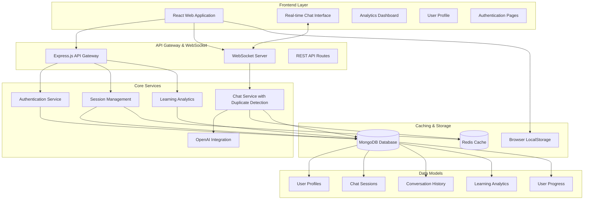
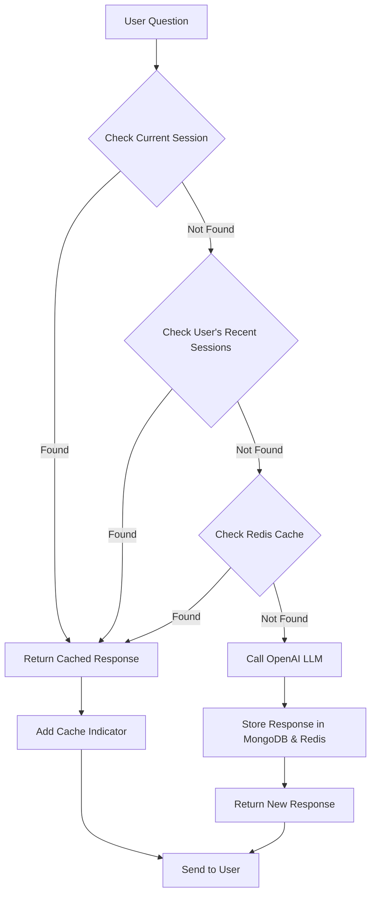

# ML-E Design Document

## Overview

ML-E is an intelligent AI tutoring system designed to teach Machine Learning concepts to high school students (grades 9-10) through an interactive web application. The system provides personalized, adaptive learning experiences with real-time chat interaction, persistent session management, and intelligent response caching.

The architecture follows a modern web application pattern with intelligent chat capabilities, enabling scalable, maintainable, and efficient educational delivery. The system features advanced duplicate detection to optimize LLM usage, persistent MongoDB storage for conversation history, and seamless user experience across navigation.

**Key Features:**
- Real-time chat interface with ML-focused AI tutor
- Persistent conversation history across sessions
- Intelligent duplicate question detection and caching
- Comprehensive learning analytics and progress tracking
- Clean, responsive user interface optimized for students
- Cross-session conversation continuity

## Architecture

### High-Level Architecture



### Chat System Architecture

The intelligent chat system follows an optimized request-response pattern:

1. **WebSocket Communication**: Real-time bidirectional communication between frontend and backend
2. **Duplicate Detection Engine**: Multi-level caching system to avoid redundant LLM calls
3. **Persistent Storage**: MongoDB for conversation history and Redis for fast access
4. **OpenAI Integration**: Grade-appropriate ML tutoring with GPT-3.5-turbo
5. **Session Continuity**: Seamless conversation persistence across navigation

#### Duplicate Detection Flow


## Components and Interfaces

### Frontend Components

#### Chat Interface
- **Purpose**: Primary interaction point between students and the AI tutor
- **Features**: 
  - Real-time messaging with WebSocket communication
  - Typing indicators for enhanced user experience
  - Message persistence across navigation
  - Automatic session continuity
  - Clean, responsive design optimized for students
  - Instant responses for duplicate questions
- **Technology**: React with Socket.io client, persistent localStorage integration
- **Performance**: Cached responses delivered in <100ms, new responses in 2-5 seconds

#### Analytics Dashboard
- **Purpose**: Comprehensive learning analytics and progress visualization
- **Features**:
  - Real-time learning metrics and statistics
  - Session activity tracking
  - Topic engagement analysis
  - Progress trends and insights
  - Interactive charts and visualizations
  - Performance comparison over time
- **Technology**: React with Chart.js for data visualization, real-time updates via API

### Backend Services

#### API Gateway
- **Purpose**: Single entry point for all client requests with routing and authentication
- **Responsibilities**:
  - Request routing to appropriate services
  - Authentication and authorization
  - Rate limiting and security
  - Response aggregation from multiple agents
- **Technology**: Express.js with middleware for security and logging

#### WebSocket Service
- **Purpose**: Real-time communication hub with intelligent response management
- **Responsibilities**:
  - Handle real-time chat communication
  - Implement multi-level duplicate detection
  - Manage session persistence and continuity
  - Integrate with OpenAI for fresh responses
  - Store conversations in MongoDB
  - Cache responses in Redis for fast access
- **Technology**: Socket.io with Express.js, MongoDB integration, Redis caching

#### OpenAI Integration Service
- **Purpose**: Grade-appropriate ML tutoring with advanced language models
- **Responsibilities**:
  - Generate educational responses tailored to student grade level
  - Explain ML concepts in age-appropriate language
  - Provide examples and analogies suitable for high school students
  - Maintain conversational and engaging tone
  - Adapt complexity based on user grade (9 or 10)
- **Technology**: OpenAI GPT-3.5-turbo with custom prompting system

#### Duplicate Detection Engine
- **Purpose**: Intelligent caching system to optimize LLM usage and response time
- **Responsibilities**:
  - Analyze incoming questions for similarity to previous queries
  - Search current session conversation history
  - Check user's recent sessions for duplicate questions
  - Implement advanced similarity algorithms
  - Return cached responses with appropriate indicators
  - Reduce API costs and improve response times
- **Technology**: Custom similarity algorithms with MongoDB queries and Redis caching

### Core Services

#### Authentication Service
- **Purpose**: Manage user accounts, sessions, and security
- **Features**:
  - Student account creation and management
  - Secure session handling
  - Role-based access control
- **Technology**: JWT tokens with bcrypt password hashing

#### Session Management
- **Purpose**: Comprehensive session state management with persistence
- **Features**:
  - Persistent conversation history in MongoDB
  - Fast session access via Redis caching
  - Cross-navigation session continuity
  - Automatic session recovery
  - Multi-session support per user
  - Session cleanup and optimization
- **Technology**: Dual storage strategy - MongoDB for persistence, Redis for performance
- **Performance**: Session data accessible in <50ms, automatic 24-hour cleanup

#### Learning Analytics
- **Purpose**: Comprehensive learning analytics and progress tracking
- **Features**:
  - Real-time session activity monitoring
  - Topic engagement analysis
  - Learning progress visualization
  - Performance metrics and trends
  - User behavior insights
  - Conversation analytics
- **Technology**: MongoDB aggregation pipelines with real-time API endpoints
- **Metrics**: Session duration, message counts, topic coverage, engagement patterns

## Data Models

### User Model
```typescript
interface User {
  id: string;
  username: string;
  email: string;
  grade: 9 | 10;
  createdAt: Date;
  lastActive: Date;
  preferences: UserPreferences;
}

interface UserPreferences {
  learningPace: 'slow' | 'medium' | 'fast';
  preferredExamples: string[];
  difficultyLevel: number;
}
```

### Learning Session Model
```typescript
interface LearningSession {
  id: string;
  userId: string;
  startTime: Date;
  endTime?: Date;
  currentTopic: string;
  conversationHistory: Message[];
  agentStates: AgentState[];
  progressSnapshot: ProgressData;
}

interface Message {
  id: string;
  sender: 'student' | 'tutor';
  content: string;
  timestamp: Date;
  metadata: MessageMetadata;
}

interface MessageMetadata {
  messageType: 'explanation' | 'question' | 'assessment' | 'feedback' | 'system';
  agentId?: string;
  topicId?: string;
  difficulty?: number;
  hasCode: boolean;
  hasMath: boolean;
}

interface ChatMessage {
  id: string;
  userId: string;
  username: string;
  message: string;
  timestamp: Date;
  sessionId?: string;
  agentResponse?: boolean;
}
```

### Progress Model
```typescript
interface StudentProgress {
  userId: string;
  topicsCompleted: TopicProgress[];
  currentLevel: number;
  totalTimeSpent: number;
  assessmentScores: AssessmentResult[];
  learningPath: string[];
}

interface TopicProgress {
  topicId: string;
  completionPercentage: number;
  masteryLevel: 'beginner' | 'intermediate' | 'advanced';
  timeSpent: number;
  lastAccessed: Date;
}
```

### Analytics Model
```typescript
interface LearningAnalytics {
  userId: string;
  sessionId: string;
  topicId: string;
  topicName: string;
  action: 'started' | 'progressed' | 'completed' | 'struggled';
  progressPercentage: number;
  timeSpent: number;
  difficultyLevel: number;
  masteryLevel: 'beginner' | 'intermediate' | 'advanced';
  timestamp: Date;
  metadata: {
    conceptsUnderstood: string[];
    questionsAnswered: number;
    hintsUsed?: number;
  };
}

interface SessionActivity {
  sessionId: string;
  userId: string;
  messageCount: number;
  questionCount: number;
  duration: number;
  topicsDiscussed: string[];
  lastActivity: Date;
}
```

## Error Handling

### Service Failure Management
- **Graceful Degradation**: When MongoDB fails, system falls back to Redis-only operation
- **Fallback Mechanisms**: Redis cache provides backup when primary database is unavailable
- **Error Recovery**: Automatic retry logic with exponential backoff for external API calls
- **User Communication**: Clear error messages without exposing technical details

### System Resilience
- **Dual Storage Strategy**: MongoDB for persistence + Redis for performance ensures data availability
- **Connection Monitoring**: Continuous monitoring of database and API connections
- **Cache Management**: Intelligent cache invalidation and refresh strategies
- **Data Consistency**: Eventual consistency between MongoDB and Redis with conflict resolution

### User Experience Protection
- **Seamless Operation**: Transparent fallback between storage systems without user awareness
- **Context Preservation**: Maintain conversation context during service failures
- **Response Guarantees**: Always provide a response within 10 seconds, using cache if needed
- **Progress Protection**: Ensure conversation history is never lost due to system failures
- **Clean Interface**: No connection status messages to avoid user confusion

## Testing Strategy

### Unit Testing
- **Chat Service Logic**: Test duplicate detection algorithms and similarity matching
- **API Endpoints**: Comprehensive testing of all REST and WebSocket endpoints
- **Data Models**: Validation and serialization testing for MongoDB schemas
- **Utility Functions**: Core business logic and helper functions

### Integration Testing
- **WebSocket Communication**: Test real-time messaging and session management
- **Database Operations**: Test MongoDB and Redis integration and fallback mechanisms
- **Authentication Flow**: End-to-end authentication and authorization testing
- **OpenAI Integration**: Test LLM API integration and error handling

### End-to-End Testing
- **Complete Learning Scenarios**: Full student interaction flows from login to learning
- **Session Persistence**: Test conversation continuity across navigation
- **Duplicate Detection**: Verify caching works across sessions and similar questions
- **Performance Testing**: Load testing with multiple concurrent chat sessions
- **Accessibility Testing**: Ensure compliance with WCAG guidelines

### Specialized Testing
- **Duplicate Detection Accuracy**: Test similarity algorithms with various question formats
- **Cache Performance**: Verify response times for cached vs. new responses
- **Session Continuity**: Test message persistence across browser refreshes and navigation
- **Failure Scenarios**: Test system behavior when MongoDB, Redis, or OpenAI fails
- **Cross-Session Detection**: Verify duplicate detection works across different sessions

### Performance Benchmarks
- **Response Times**: Cached responses <100ms, new responses <5s
- **Storage Efficiency**: MongoDB persistence + Redis performance optimization
- **API Cost Optimization**: Measure reduction in OpenAI API calls through caching
- **Concurrent Users**: Support for 100+ simultaneous chat sessions