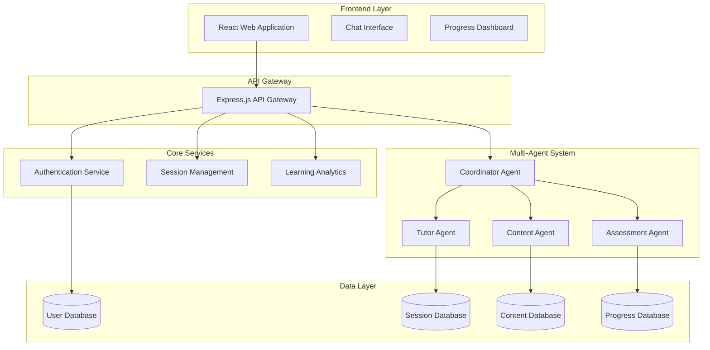

# ML-E Design Document

## Overview

ML-E is a multi-agentic AI tutoring system designed to teach Machine Learning concepts to high school students through an interactive web application. The system employs a coordinated network of specialized AI agents, each with distinct responsibilities, working together to provide personalized, adaptive learning experiences.

The architecture follows a microservices pattern with agent orchestration, enabling scalable, maintainable, and resilient educational delivery. The system adapts to individual learning patterns while maintaining consistency across agent interactions.

## Architecture

### High-Level Architecture



### Agent Architecture

The multi-agent system follows a hierarchical coordination pattern:

1. **Coordinator Agent**: Central orchestrator managing agent interactions and workflow
2. **Specialized Agents**: Domain-specific agents handling distinct educational functions
3. **Shared Context**: Common knowledge base and session state accessible to all agents
4. **Communication Protocol**: Standardized messaging between agents

## Components and Interfaces

### Frontend Components

#### Chat Interface
- **Purpose**: Primary interaction point between students and the multi-agent system
- **Features**: 
  - Real-time messaging with typing indicators
  - Mathematical notation rendering (MathJax)
  - Code syntax highlighting for ML examples
  - Agent identification in responses
- **Technology**: React with Socket.io for real-time communication

#### Progress Dashboard
- **Purpose**: Visual representation of learning progress and achievements
- **Features**:
  - Topic completion tracking
  - Skill level indicators
  - Learning path visualization
  - Performance analytics
- **Technology**: React with D3.js for data visualization

### Backend Services

#### API Gateway
- **Purpose**: Single entry point for all client requests with routing and authentication
- **Responsibilities**:
  - Request routing to appropriate services
  - Authentication and authorization
  - Rate limiting and security
  - Response aggregation from multiple agents
- **Technology**: Express.js with middleware for security and logging

#### Multi-Agent System

##### Coordinator Agent
- **Purpose**: Orchestrates interactions between specialized agents and manages conversation flow
- **Responsibilities**:
  - Route student queries to appropriate agents
  - Aggregate responses from multiple agents
  - Maintain conversation context and state
  - Handle agent failures and fallback scenarios
- **Technology**: Node.js with agent communication framework

##### Tutor Agent
- **Purpose**: Primary educational content delivery and conversation management
- **Responsibilities**:
  - Explain ML concepts in age-appropriate language
  - Provide examples and analogies
  - Maintain conversational flow
  - Adapt explanations based on student feedback
- **Technology**: Integration with LLM API (OpenAI/Anthropic) with custom prompting

##### Assessment Agent
- **Purpose**: Evaluate student understanding and generate appropriate exercises
- **Responsibilities**:
  - Create comprehension questions
  - Analyze student responses for understanding
  - Recommend difficulty adjustments
  - Track learning progress metrics
- **Technology**: Custom ML models for assessment with LLM integration

##### Content Agent
- **Purpose**: Generate and adapt educational materials based on student needs
- **Responsibilities**:
  - Create practice problems and examples
  - Adapt content difficulty dynamically
  - Generate visual aids and diagrams
  - Maintain curriculum structure
- **Technology**: Content generation pipeline with template system

### Core Services

#### Authentication Service
- **Purpose**: Manage user accounts, sessions, and security
- **Features**:
  - Student account creation and management
  - Secure session handling
  - Role-based access control
- **Technology**: JWT tokens with bcrypt password hashing

#### Session Management
- **Purpose**: Maintain learning session state and context
- **Features**:
  - Conversation history persistence
  - Agent state synchronization
  - Session recovery and continuation
- **Technology**: Redis for session storage with MongoDB persistence

#### Learning Analytics
- **Purpose**: Track and analyze student learning patterns
- **Features**:
  - Progress tracking across topics
  - Learning velocity analysis
  - Difficulty adjustment recommendations
  - Performance reporting
- **Technology**: Time-series database (InfluxDB) with analytics processing

## Data Models

### User Model
```typescript
interface User {
  id: string;
  username: string;
  email: string;
  grade: 9 | 10;
  createdAt: Date;
  lastActive: Date;
  preferences: UserPreferences;
}

interface UserPreferences {
  learningPace: 'slow' | 'medium' | 'fast';
  preferredExamples: string[];
  difficultyLevel: number;
}
```

### Learning Session Model
```typescript
interface LearningSession {
  id: string;
  userId: string;
  startTime: Date;
  endTime?: Date;
  currentTopic: string;
  conversationHistory: Message[];
  agentStates: AgentState[];
  progressSnapshot: ProgressData;
}

interface Message {
  id: string;
  sender: 'student' | 'tutor' | 'assessment' | 'content';
  content: string;
  timestamp: Date;
  metadata: MessageMetadata;
}
```

### Progress Model
```typescript
interface StudentProgress {
  userId: string;
  topicsCompleted: TopicProgress[];
  currentLevel: number;
  totalTimeSpent: number;
  assessmentScores: AssessmentResult[];
  learningPath: string[];
}

interface TopicProgress {
  topicId: string;
  completionPercentage: number;
  masteryLevel: 'beginner' | 'intermediate' | 'advanced';
  timeSpent: number;
  lastAccessed: Date;
}
```

### Agent State Model
```typescript
interface AgentState {
  agentId: string;
  sessionId: string;
  context: Record<string, any>;
  lastAction: string;
  status: 'active' | 'idle' | 'error';
  capabilities: string[];
}
```

## Error Handling

### Agent Failure Management
- **Graceful Degradation**: When an agent fails, the Coordinator redistributes responsibilities
- **Fallback Mechanisms**: Backup agents or simplified responses when primary agents are unavailable
- **Error Recovery**: Automatic retry logic with exponential backoff
- **User Communication**: Clear error messages without exposing technical details

### System Resilience
- **Circuit Breaker Pattern**: Prevent cascade failures between agents
- **Health Monitoring**: Continuous monitoring of agent and service health
- **Automatic Scaling**: Dynamic resource allocation based on load
- **Data Consistency**: Eventual consistency model with conflict resolution

### User Experience Protection
- **Seamless Handoffs**: Transparent agent switching without user awareness
- **Context Preservation**: Maintain conversation context during failures
- **Response Guarantees**: Always provide a response within 10 seconds, even if simplified
- **Progress Protection**: Ensure learning progress is never lost due to system failures

## Testing Strategy

### Unit Testing
- **Agent Logic**: Test individual agent decision-making and response generation
- **API Endpoints**: Comprehensive testing of all REST endpoints
- **Data Models**: Validation and serialization testing
- **Utility Functions**: Core business logic and helper functions

### Integration Testing
- **Agent Communication**: Test message passing and coordination between agents
- **Database Operations**: Test data persistence and retrieval across services
- **Authentication Flow**: End-to-end authentication and authorization testing
- **External API Integration**: Test LLM API integration and error handling

### End-to-End Testing
- **Learning Scenarios**: Complete student learning journeys from start to finish
- **Multi-Agent Workflows**: Test complex scenarios requiring multiple agent coordination
- **Performance Testing**: Load testing with multiple concurrent users
- **Accessibility Testing**: Ensure compliance with WCAG guidelines

### Agent-Specific Testing
- **Response Quality**: Evaluate educational content quality and age-appropriateness
- **Coordination Logic**: Test agent handoffs and collaboration scenarios
- **Adaptive Behavior**: Verify agents adapt correctly to student performance
- **Failure Scenarios**: Test system behavior when individual agents fail

The testing strategy emphasizes the unique challenges of multi-agent systems, including coordination, consistency, and graceful degradation under failure conditions.