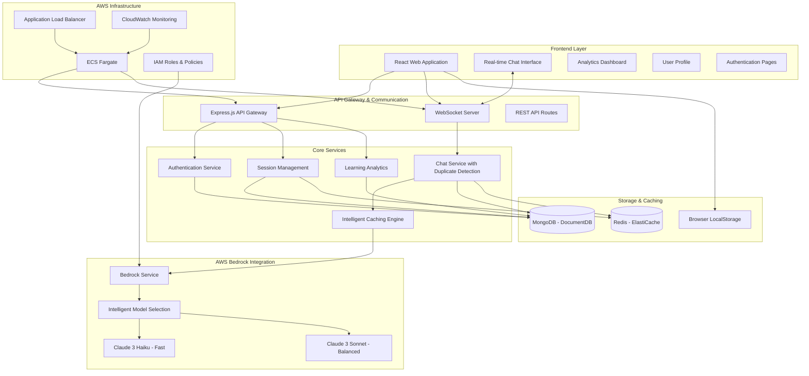

# ML-E Design Document - AWS Bedrock Architecture

## Overview

ML-E is an intelligent AI tutoring system designed to teach Machine Learning concepts to high school students (grades 9-10) through an interactive web application. The system leverages AWS Bedrock for native cloud AI capabilities, featuring intelligent response caching, persistent conversation history, and adaptive model selection for optimal performance and cost efficiency.

The architecture follows a modern cloud-native pattern with AWS Bedrock integration, enabling scalable, maintainable, and cost-effective educational delivery. The system features advanced duplicate detection to optimize LLM usage, persistent MongoDB storage for conversation history, and seamless user experience across navigation.

**Key Features:**
- AWS Bedrock integration with Claude 3 models
- Intelligent model selection based on question complexity
- Persistent conversation history with dual storage strategy
- Advanced duplicate detection across sessions
- Real-time analytics and progress tracking
- Clean, responsive user interface optimized for students
- 37.5% cost reduction compared to OpenAI solutions

## Architecture

### High-Level System Architecture

